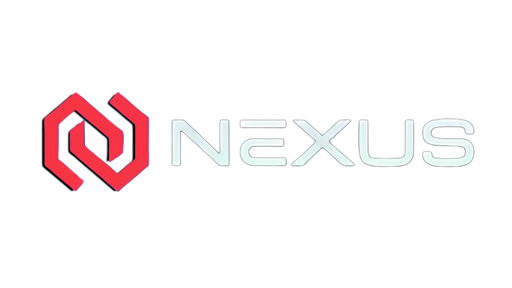

<p align="center">
  
</p>

<h1 align="center">NEXUS</h1>
<p align="center">
  <strong>Stream Movies, TV Shows & Anime in HD Quality</strong>
</p>

<p align="center">
  <a href="https://www.zeticuz.online">🌐 Live Demo</a> •
  <a href="#features">✨ Features</a> •
  <a href="#installation">📦 Installation</a> •
  <a href="#whats-new">🆕 What's New</a>
</p>

---

## 🎬 About NEXUS

**NEXUS** is a premium streaming platform built as a Progressive Web App (PWA). Watch unlimited movies, TV shows, and anime in high quality across all devices.

---

## ✨ Features

### Core Features

- 🎬 **Unlimited Streaming** - Movies, TV Shows, and Anime library
- 🔍 **Smart Search** - Find content instantly with intelligent search
- 📚 **Bookmarks** - Save favorites for later viewing
- 🎯 **Auto-Quality** - Adaptive streaming based on connection speed
- 🌐 **Multi-Source** - Multiple video sources for reliability

### Player Features

- advancement advancement advancement ▶️ **Netflix-Style Player** - Modern, intuitive video player
- 🔒 **Screen Lock** - Prevent accidental touches while watching (Mobile)
- 📺 **Chromecast Support** - Cast to your TV
- 🖥️ **Picture-in-Picture** - Watch while multitasking
- ⏩ **Skip Forward/Backward** - 10-second skip controls
- 🎚️ **Volume Control** - Smooth volume adjustment
- 📝 **Subtitles** - Multi-language subtitle support
- ⚙️ **Quality Selection** - Manual quality control

### PWA Features

- 📱 **Install as App** - Add to home screen on any device
- 🖥️ **Edge-to-Edge Display** - Fullscreen immersive viewing
- 🔄 **Auto-Rotate** - Landscape mode on fullscreen (Mobile)
- 🚀 **Offline Capable** - Service worker caching
- 📲 **Push Notifications** - Get updates on new content

---

## 🆕 What's New (Latest Update)

### v5.3.2 - January 2026

#### 🎮 Player Enhancements

- **Screen Lock Button** - Netflix-style lock in bottom controls (Mobile fullscreen)
- **Auto-Hide Controls** - Logo and lock button auto-hide when not interacting
- **Auto-Rotate** - Automatic landscape rotation on fullscreen
- **Improved Touch Handling** - Better mobile touch response

#### 🎨 UI/UX Improvements

- **Edge-to-Edge PWA** - Status bar blends seamlessly with content
- **Chromecast in Top Bar** - Easy access to casting
- **Clean Locked Screen** - No UI obstruction when locked

#### ⚡ Performance

- **Project Cleanup** - Removed ~4.5MB of unused files
- **Optimized Build** - Faster load times
- **New M3U8 Proxies** - Added 3 new proxy servers for reliability

---

## 📦 Installation

### Prerequisites

- Node.js 18+
- pnpm (recommended) or npm

### Quick Start

```bash
# 1. Clone the repository
git clone https://github.com/reyamae14-cyber/nexusFINAL.git

# 2. Navigate to project directory
cd nexusFINAL

# 3. Install dependencies
pnpm install

# 4. Create environment file
cp example.env .env

# 5. Configure your .env file (see Environment Variables section)

# 6. Start development server
pnpm dev

# 7. Open in browser
# Visit http://localhost:5173
```

### Production Build

```bash
# Build for production
pnpm build

# Preview production build
pnpm preview
```

---

## ⚙️ Environment Variables

Create a `.env` file in the root directory:

```env
# TMDB API Key (Required)
VITE_TMDB_READ_API_KEY=your_tmdb_read_api_key

# CORS Proxy URLs (comma-separated)
VITE_CORS_PROXY_URL=https://your-cors-proxy.com

# Backend URL
VITE_BACKEND_URL=https://your-backend.com

# M3U8 Proxy URLs (comma-separated)
VITE_M3U8_PROXY_URL=https://proxy1.com,https://proxy2.com

# App Domain
VITE_APP_DOMAIN=https://your-domain.com

# Feature Flags
VITE_PWA_ENABLED=true
VITE_HAS_ONBOARDING=true
VITE_ALLOW_AUTOPLAY=true
VITE_HIDE_PROXY_SETTINGS=true
```

---

## 🚀 Deployment

### Vercel (Recommended)

1. Push to GitHub
2. Connect to Vercel
3. Set environment variables in Vercel dashboard
4. Deploy!

```bash
# Or deploy via CLI
npx vercel --prod
```

### Docker

```bash
docker-compose up -d
```

---

## 📱 PWA Installation

### On Mobile (iOS/Android)

1. Visit https://www.zeticuz.online
2. Tap the share button
3. Select "Add to Home Screen"
4. Tap "Add"

### On Desktop (Chrome/Edge)

1. Visit https://www.zeticuz.online
2. Click the install icon in the address bar
3. Click "Install"

---

## 🛠️ Tech Stack

| Category | Technology               |
| -------- | ------------------------ |
| Frontend | React 18, TypeScript     |
| Build    | Vite                     |
| Styling  | Tailwind CSS             |
| State    | Zustand                  |
| Video    | HLS.js, Custom Player    |
| PWA      | Workbox, Service Workers |
| Routing  | React Router v6          |

---

## 📄 License

This project is proprietary software owned by **reyamae14-cyber**.

See [LICENSE.md](LICENSE.md) for full terms.

---

## 👤 Author

**reyamae14-cyber**

---

<p align="center">
  <strong>© 2026 NEXUS. All rights reserved.</strong>
</p>
