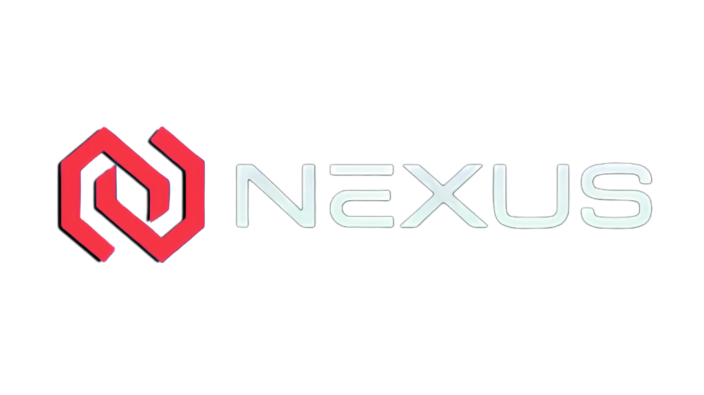

<p align="center">
  
</p>

<h1 align="center">NEXUS</h1>
<p align="center">
  <strong>Stream Movies, TV Shows & Anime in HD Quality</strong>
</p>

<p align="center">
  <a href="https://www.zeticuz.online">🌐 Live Demo</a> •
  <a href="#features">✨ Features</a> •
  <a href="#installation">📦 Installation</a> •
  <a href="#whats-new">🆕 What's New</a>
</p>

---

## 🎬 About NEXUS

**NEXUS** is a premium streaming platform built as a Progressive Web App (PWA). Watch unlimited movies, TV shows, and anime in high quality across all devices.

---

## ✨ Features

### Core Features

- 🎬 **Unlimited Streaming** - Movies, TV Shows, and Anime library
- 🔍 **Smart Search** - Find content instantly with intelligent search
- 📚 **Bookmarks** - Save favorites for later viewing
- 🎯 **Auto-Quality** - Adaptive streaming based on connection speed
- 🌐 **Multi-Source** - Multiple video sources for reliability

### Player Features

- advancement advancement advancement ▶️ **Netflix-Style Player** - Modern, intuitive video player
- 🔒 **Screen Lock** - Prevent accidental touches while watching (Mobile)
- 📺 **Chromecast Support** - Cast to your TV
- 🖥️ **Picture-in-Picture** - Watch while multitasking
- ⏩ **Skip Forward/Backward** - 10-second skip controls
- 🎚️ **Volume Control** - Smooth volume adjustment
- 📝 **Subtitles** - Multi-language subtitle support
- ⚙️ **Quality Selection** - Manual quality control

### PWA Features

- 📱 **Install as App** - Add to home screen on any device
- 🖥️ **Edge-to-Edge Display** - Fullscreen immersive viewing
- 🔄 **Auto-Rotate** - Landscape mode on fullscreen (Mobile)
- 🚀 **Offline Capable** - Service worker caching
- 📲 **Push Notifications** - Get updates on new content

---

## 🆕 What's New

### v6.3.0 - July 1, 2026 (Updated: 1:04 AM PHT)

#### 🌐 Dual Backend Account & Watch Session Synchronization
- **Dual-Server Integration** - Configured simultaneous registration, login, and settings updates across both `https://movies.dovetechnology.org` (SPECTRUM) and `https://court.fontaine.lol` (REAPER) backends.
- **Failover & High Availability** - Built a robust fallback mechanism; if one backend goes offline, users continue watching seamlessly with the online node.
- **Dynamic Data Reconciliation** - Implemented automatic synchronization: bookmarks, progress, and history updates cache locally and broadcast to recovering backends once they reconnect.
- **Vite Local Dev Proxy** - Masked local development API origins using Vite configurations for proxy masking.

#### 🔺 Interactive Trust Verification Screen
- **Modern Conic Border animations** - Enabled glowing conic-gradient borders on node cards when hovered.
- **Animating Motion Icons** - Replaced static icons with animating `UserRoundCogIcon` (rotates cog on hover) and `DatabaseBackupIcon` (rotates restore path on hover) powered by Framer Motion.
- **Visual Connection Graph** - Crafted curved SVG path flows with animating neon particles/comets representing live traffic streaming from User Data down to the databases.
- **Spacious Pyramid Layout** - Replaced squished layouts with a wide, responsive pixel-perfect pyramid map (SPECTRUM at 16%, REAPER at 84% width alignment).
- **Externalized Status Indicators** - Moved active indicator pills (Online/Offline check) below the nodes for cleaner visibility.

#### 📝 Subtitle Mapping Refinements
- **English Language Defaults** - Automatically renames empty or unknown subtitles to "English".
- **Source Attribute Fix** - Maps the provider of these subtitles as "OpenSubtitles" instead of "Unknown".

---

### v6.2.0 - June 11, 2026 (Updated: 8:33 PM PHT)

#### 📲 QR-Based Multi-Device Passwordless Login & Session Sync

- **One-Click QR Code Generator** - Added "Log in using other device" button to the landing page that dynamically displays a clean, transparent QR code floating over the background movie posters.
- **Magnification Modal** - Clicking the QR code opens a large overlay modal for quick and easy mobile camera scanning.
- **Settings Camera Scanner & Upload** - Added a fully functional QR code scanner directly under `Settings > Scan QR Code`. Supports laptop/mobile live camera permissions or uploading a screenshot/image of the QR code.
- **Secure Auth Claim Page (`QRLoginClaimPage`)** - Implemented a dedicated authorization endpoint that allows any logged-in device to scan the QR, review the connection request, and securely authenticate the new device.
- **Client Recognition & Animated Confirmation** - The scanning device displays a purple badge with the requestor's device browser metadata (e.g. "Chrome on Linux") and an animated double-pulsing green checkmark once authorized.
- **Real-Time Redirection** - Initiating tab detects the approved authorization, displays "Login request approved" with a check animation, and instantly redirects to the onboarding path.
- **Clean Interface Design** - Removed the dark backdrop from the landing page QR code for a modern, borderless look, adding bold instructional text: *"Scan the QR code on your device to log in. Go to Settings > Scan QR Code."*

#### 🖼️ User Profile Avatar Uploads & Vercel Blob Integration

- **Vercel Blob Storage** - Integrated `@vercel/blob` storage to handle secure uploading and hosting of user-defined profile pictures.
- **Dynamic Profile Editing** - Profile photos are instantly uploaded and updated across sessions via Vercel Blob.

---

### v6.1.0 - May 29, 2026 (Updated: 6:20 PM PHT)

#### 📱 Cuts — Full Mobile Overhaul

- **Mobile Side Panel Fixed** - Removed the "Coming Soon" blocker from the mobile sidebar. Cuts now navigates correctly from the Browse dropdown and slide-out menu panel on all mobile devices.
- **True Fullscreen on Mobile** - Cuts now uses `position: fixed; inset: 0` with `z-index: 900`, taking over the entire viewport like TikTok/Reels/YouTube Shorts. The bottom navigation bar automatically hides when Cuts is open.
- **iOS Safe Area Support** - Action buttons (Save, Mute, Next) and the bottom info panel now respect `env(safe-area-inset-bottom)` so they never hide behind the iPhone home indicator or Android gesture bar.
- **Dynamic Viewport Height** - Uses `100dvh` (dynamic viewport height) for pixel-perfect fullscreen on mobile browsers where the URL bar hides/shows on scroll.
- **Watch Now Stops Trailer** - Pressing "Watch Now" now immediately pauses and mutes the YouTube player before opening the movie details modal — no more audio bleed-through into the movie page.

---

### v6.0.0 - May 29, 2026 (Updated: 5:58 PM PHT)

#### 🎬 Cuts — TikTok/Reels-Style Trailer Feed *(Brand New Feature)*

- **Vertical Reels Feed** - Fullscreen snap-scroll trailer experience powered by TMDB + YouTube, inspired by TikTok, YouTube Shorts, and Facebook Reels.
- **Cross-Browser Swipe & Click Fix** - Resolved layout gestures on Firefox and Safari: applied `touch-action: pan-y` on overlays and targeted pointer-events on the dynamically-injected YouTube `iframe` players so clicks/scrolls never freeze or block.
- **Auto-Play Trailers** - Up to 50 trailers per session: Trending, Pinoy, Vivamax, and Anime categories.
- **Double-Tap to Bookmark** - Heart burst animation saves any movie to your bookmarks instantly.
- **Watch Now Button** - Opens the full movie details modal directly from the reel you're watching.
- **Progress Bar** - Thin YouTube Shorts-style seekable bar shows current trailer progress.
- **Mute/Unmute Toggle** - Respects browser autoplay policy; unmutes on first user interaction.
- **Fullscreen Immersion** - Navigation bars, header, and sidebar all hidden for true cinema feel.
- **Close Button (×)** - Repositioned frosted-glass Close (×) button to the top-right (`right: 16`) to align with mobile indicators and player HUD.
- **Next Button Fixed** - Uses container `scrollTo` math for perfect alignment inside CSS scroll-snap container.

#### 🔴 Animated "NEW" Badge on Cuts in Browse Menu

- **Glowing Animated Badge** - Pulsing red "✦ NEW" label next to Cuts in the Browse dropdown alerts users to the new feature at a glance.

#### 🏠 Discover Page — Continue Watching & Bookmarks Sections

- **Continue Watching on /discover** - Your in-progress movies and shows now appear directly on the main Discover page below the tab navigation.
- **Edit Mode** - Pencil icon reveals X buttons to remove items from Continue Watching — full parity with /home functionality.
- **Bookmarks on /discover** - All saved favorites (with group support) are now surfaced on the Discover page.
- **Card Sizing** - Both sections are sized to match the Discover page's existing media card dimensions for a consistent look.
- **"Because You Watched" Moved Down** - The recommendation row now appears below Continue Watching and Bookmarks for a more logical content hierarchy.

#### 📥 Upgraded Downloads & HLS Stream Link (p-stream Style)

- **Original File & Stream Link** - Split the download options in the settings menu to support both direct file downloading ("Original File" via GoatAPI downloader) and copying the HLS stream link ("Stream Link") to clipboard with 2-second visual copying feedback.
- **Subtitle Downloads** - Integrated downloading of active caption files (.vtt/.srt) directly from the Downloads menu.
- **Provider Re-ordering** - Re-ordered and locked providers to show ONLY the top 5 premium sources: FebBox 4K ⭐ (first, rank 900) → VidLink (second, rank 890) → LookMovies (third, rank 880) → ZeticuzApi (fourth, rank 870) → Tugaflix (fifth, rank 860). All other duplicate sources are globally disabled.
- **FebBox GoatAPI Integration** - Rebuilt FebBox scraper for GoatAPI worker endpoints. Implemented parallel responsive latency pings (1080p primary priority, 4K bonus) and a fail-safe CDN cold-start bypass to prevent "No video available" errors.
- **HLS Dynamic Quality Selection** - Constructed local HLS master playlist Blob URL inside the player, enabling Hls.js dynamic ABR and seamless manual quality switching for FebBox.
- **Auto-On English Subtitles** - Player now automatically sets subtitles "on" and selects the first English VTT track upon start.

#### 🐛 Bug Fixes & Cleanup

- Fixed TypeScript / ESLint errors across multiple backend and provider files.
- Removed unused imports and clean-compiled the production bundle (`pnpm build`).
- Fixed pointer-events and touch gestures in Firefox for the Cuts trailer swiping interaction.

---

### v5.7.0 - May 15, 2026

#### 🎬 Cuts Feature Enhancements

- **Animated Cuts Icon** - Implemented a dynamic, animated icon for the Cuts feature using Framer Motion.
- **Brand Consolidation** - Fully replaced all remaining Music references with the new "Cuts" identity.
- **Interactive UI** - Added smooth micro-animations and hover effects to primary navigation elements.

#### 🔌 Extension & Logic Updates

- **Auto-Detection Reliability** - Enhanced the browser extension detection logic for seamless user onboarding.
- **Synchronized Backups** - Established automated synchronization with backup repositories for project integrity.

---

### v5.5.0 - May 15, 2026

#### 🔌 Extension Auto-Detection

- **Browser Extension Detection** - Automatically detects if the NEXUS helper extension is installed.
- **Improved Onboarding** - Streamlined extension permission flow for enhanced playback reliability.
- **Auto-Redirect** - Successfully transitions users to movies with extension-enabled sources once permissions are granted.

#### 🎨 Brand Refresh & UI Updates

- **Rebranded "Music" to "Cuts"** - Replaced the legacy Music section with the new "Cuts" feature.
- **Custom Iconography** - Integrated high-fidelity custom icons for the "Cuts" navigation item.
- **Placeholder Implementation** - Added interactive "Coming Soon" notifications for upcoming features.

---

### v5.4.0 - January 2026

#### 🎨 Landing Page Redesign

- **Single Viewport Layout** - All content fits in one screen without scrolling
- **Bigger NEXUS Branding** - Enhanced logo visibility for better brand recognition
- **Responsive Design** - Optimized for mobile, tablet, and desktop views

#### 🔍 New Animated Search Bar

- **Expand/Collapse Animation** - Clean search bar that expands on click
- **Auto-Close Feature** - Automatically collapses when empty
- **Header Integration** - Search bar integrated into main navigation

#### 🎞️ Streaming Partners Carousel

- **Infinite Loop Animation** - Seamless continuous scrolling
- **TMDB CDN Logos** - Reliable logo loading for all streaming partners
- **Responsive Sizing** - Cards adapt to screen size

#### 🧹 Navigation Improvements

- **Removed Bottom Nav Bar** - Cleaner mobile experience
- **Unified Header Navigation** - Search and notifications in top header

---

### v5.3.2 - January 2026

#### 🎮 Player Enhancements

- **Screen Lock Button** - Netflix-style lock in bottom controls (Mobile fullscreen)
- **Auto-Hide Controls** - Logo and lock button auto-hide when not interacting
- **Auto-Rotate** - Automatic landscape rotation on fullscreen
- **Improved Touch Handling** - Better mobile touch response

#### 🎨 UI/UX Improvements

- **Edge-to-Edge PWA** - Status bar blends seamlessly with content
- **Chromecast in Top Bar** - Easy access to casting
- **Clean Locked Screen** - No UI obstruction when locked

#### ⚡ Performance

- **Project Cleanup** - Removed ~4.5MB of unused files
- **Optimized Build** - Faster load times
- **New M3U8 Proxies** - Added 3 new proxy servers for reliability

---

## 📦 Installation

### Prerequisites

- Node.js 18+
- pnpm (recommended) or npm

### Quick Start

```bash
# 1. Clone the repository
git clone https://github.com/reyamae14-cyber/nexusFINAL.git

# 2. Navigate to project directory
cd nexusFINAL

# 3. Install dependencies
pnpm install

# 4. Create environment file
cp example.env .env

# 5. Configure your .env file (see Environment Variables section)

# 6. Start development server
pnpm dev

# 7. Open in browser
# Visit http://localhost:5173
```

### Production Build

```bash
# Build for production
pnpm build

# Preview production build
pnpm preview
```

---

## ⚙️ Environment Variables

Create a `.env` file in the root directory:

```env
# TMDB API Key (Required)
VITE_TMDB_READ_API_KEY=your_tmdb_read_api_key

# CORS Proxy URLs (comma-separated)
VITE_CORS_PROXY_URL=https://your-cors-proxy.com

# Backend URL
VITE_BACKEND_URL=https://your-backend.com

# M3U8 Proxy URLs (comma-separated)
VITE_M3U8_PROXY_URL=https://proxy1.com,https://proxy2.com

# App Domain
VITE_APP_DOMAIN=https://your-domain.com

# Feature Flags
VITE_PWA_ENABLED=true
VITE_HAS_ONBOARDING=true
VITE_ALLOW_AUTOPLAY=true
VITE_HIDE_PROXY_SETTINGS=true

# Storage (Required for profile image uploads and QR session handshake data)
BLOB_READ_WRITE_TOKEN=your_vercel_blob_token
```

---

## 🚀 Deployment

### Vercel (Recommended)

1. Push to GitHub
2. Connect to Vercel
3. Set environment variables in Vercel dashboard
4. Deploy!

```bash
# Or deploy via CLI
npx vercel --prod
```

### Docker

```bash
docker-compose up -d
```

---

## 📱 PWA Installation

### On Mobile (iOS/Android)

1. Visit <https://www.zeticuz.online>
2. Tap the share button
3. Select "Add to Home Screen"
4. Tap "Add"

### On Desktop (Chrome/Edge)

1. Visit <https://www.zeticuz.online>
2. Click the install icon in the address bar
3. Click "Install"

---

## 🛠️ Tech Stack

| Category | Technology                                         |
| -------- | -------------------------------------------------- |
| Frontend | React 18, TypeScript                               |
| Build    | Vite                                               |
| Styling  | Tailwind CSS                                       |
| State    | Zustand                                            |
| Video    | HLS.js, Custom Player                              |
| PWA      | Workbox, Service Workers                           |
| Routing  | React Router v6                                    |
| Storage  | Vercel Blob Storage                                |
| QR Code  | html5-qrcode, qrcode.react                         |
| Animation| Framer Motion                                      |
| Security | @noble/hashes, @scure/bip39, crypto-js, node-forge |

---

## 📄 License

This project is proprietary software owned by **reyamae14-cyber**.

See [LICENSE.md](LICENSE.md) for full terms.

---

## 👤 Author

**reyamae14-cyber**

---

<p align="center">
  <strong>© 2026 NEXUS. All rights reserved.</strong>
</p>
