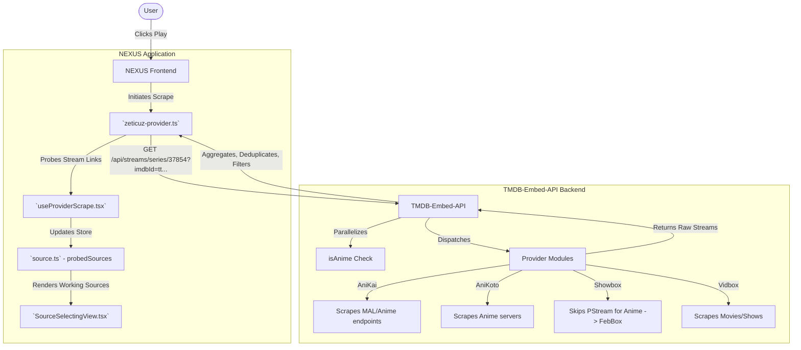

# ZETICUZ SYSTEM ARCHITECTURE & BRAIN 🧠

This document serves as the absolute "Brain" for the Zeticuz streaming architecture. It details how the **NEXUS Frontend** and the **TMDB-Embed-API Backend** interact, how data flows between them, and where to look when troubleshooting or editing.

**Any AI Assistant reading this document should use it as the source of truth for understanding the streaming infrastructure of this project.**

---

## 🏗️ 1. High-Level Architecture

The system consists of two main pieces:
1. **NEXUS (Frontend):** A React/Vite web application that provides the UI, video player, and manages stream state.
2. **TMDB-Embed-API (Backend):** An Express.js Node API that aggregates, decrypts, and normalizes streams from various video hosting providers (AniKai, AniKoto, Showbox, Vidbox, DahmerMovies, 4KHDHub, etc).

### Architectural Flowchart

---

## 🔗 2. How NEXUS Connects to the Backend

NEXUS does not scrape raw websites directly; it delegates the heavy lifting to the `TMDB-Embed-API`.

### Key NEXUS Files:
- **`src/backend/providers/zeticuz-provider.ts`**: This is the heart of the frontend connection. It defines the `buildStreamsUrl` function. It automatically pulls the `imdbId` from the frontend player metadata and passes it to the backend to speed up lookups.
- **`src/hooks/useProviderScrape.tsx`**: Contains `probeZeticuzProviders`. Before NEXUS shows a source in the player menu, this hook "probes" the API to see which providers *actually returned working links*. It sets `probedSources` so the UI only shows sources that are guaranteed to play.
- **`src/components/player/atoms/settings/SourceSelectingView.tsx` & `src/pages/parts/player/SourceSelectPart.tsx`**: The UI components. They filter their internal lists against the `probedSources` state so empty providers (like AniKai on a movie, or an empty Showbox result) are hidden from the user entirely.
- **`src/stores/player/slices/source.ts`**: The Zustand store that holds `probedSources` and `imdbId`.

---

## ⚙️ 3. How TMDB-Embed-API Works

The backend acts as an aggregator and decryption layer.

### Core Route (`apiServer.js`)
- **Route:** `GET /api/streams/:type/:tmdbId` (e.g., `/api/streams/series/37854?season=23&episode=1165&imdbId=tt0388629`)
- **Process:** 
  1. Captures `imdbId` from the query string (passed by NEXUS) to bypass slow TMDB lookups.
  2. Spawns an asynchronous parallel check for `isAnime` (checks if TMDB Genre = 16) so it doesn't block stream fetching.
  3. Uses `Promise.all()` to run all registered providers concurrently with a strict 12-second timeout.
  4. Returns a normalized JSON payload of all decrypted `.m3u8` streams.

### Provider Logic (`providers/*.js`)
Each provider file (e.g., `anikai.js`, `showbox.js`) exports a `fetch()` function.
- **Anime Detection Optimization:** `Showbox.js` has a specific optimization where it detects if the content is anime. If it is, it completely bypasses the `PStream` API (which lacks anime) and goes straight to fetching from `FebBox`.
- **Quality Filtering:** Providers are responsible for sorting streams by resolution (1080p, 720p, 480p, 360p, Auto). The backend guarantees that lower qualities (like 360p) are preserved if no higher quality exists (critical for older anime).

---

## 🛠️ 4. Troubleshooting Guide for Future AIs

When asked to edit or fix this project, check these scenarios first:

### Scenario A: A specific provider isn't showing up in NEXUS.
1. **Check the backend response:** Run `curl "http://127.0.0.1:8787/api/streams/series/[tmdbId]..."`. Does the backend actually return streams for that provider?
2. **If NO:** The provider script in `TMDB-Embed-API/providers/` is broken. The source website likely changed its DOM or encryption keys. Fix the cheerio selectors or regex inside the specific `providers/*.js` file.
3. **If YES:** The issue is in NEXUS. Check `useProviderScrape.tsx` to ensure `probeZeticuzProviders` is correctly identifying the provider ID and updating the `probedSources` state.

### Scenario B: The API is too slow.
1. Check `apiServer.js` to ensure the `Promise.all` isn't being bottlenecked by a synchronous TMDB call.
2. Check if the frontend (`zeticuz-provider.ts`) is correctly appending `&imdbId=tt...` to the URL. If it's missing, the backend wastes time fetching the IMDB ID itself.
3. Look for providers that are consistently timing out (12000ms). You can see timings in the JSON response under `providerTimings`. Disable slow providers in `config.js` if necessary.

### Scenario C: Server crashes repeatedly (EADDRINUSE).
1. The project uses PM2 (or `start-server.bat`) to daemonize the node process.
2. If `node apiServer.js` throws an `EADDRINUSE` error for port `8787`, it means the background service is already running. 
3. Run `pm2 status` or find the `node.exe` task in Task Manager to kill it before running a manual debug instance.

---
*Generated and optimized for future AI context continuity.* 🧠
